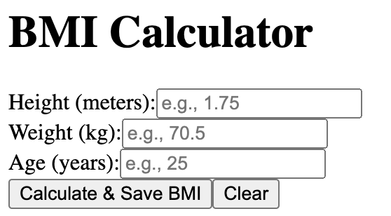
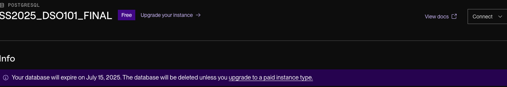
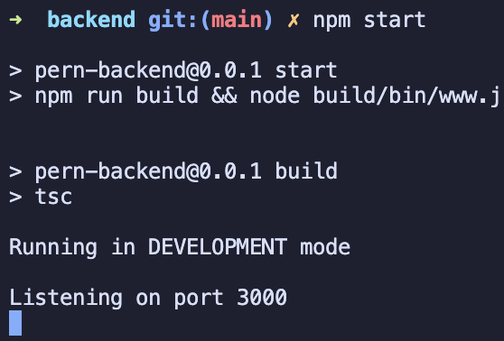
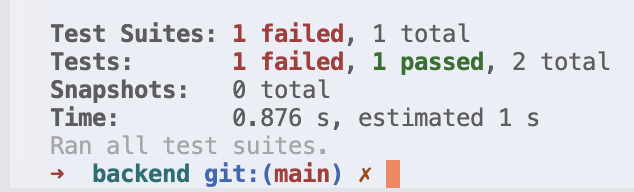
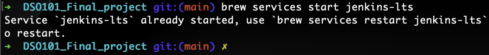
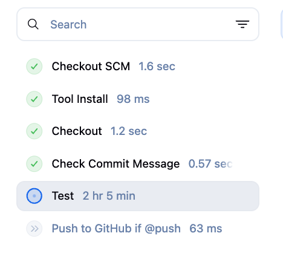
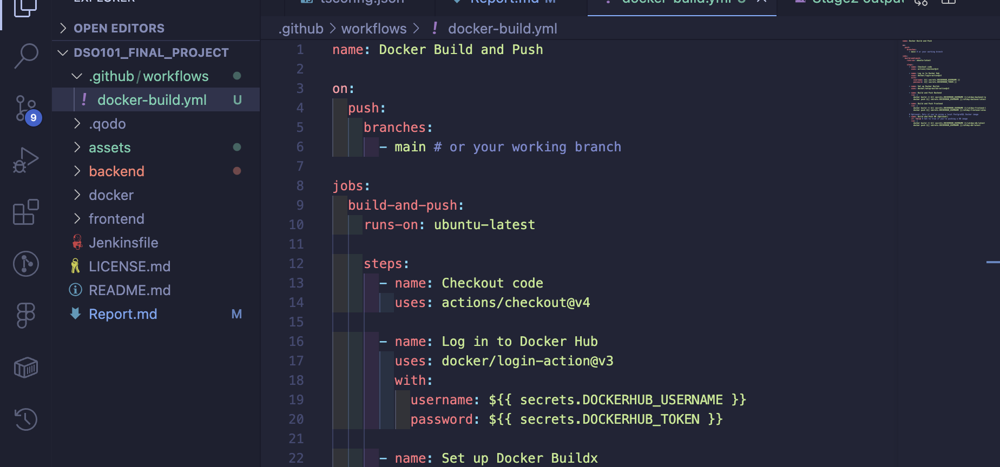
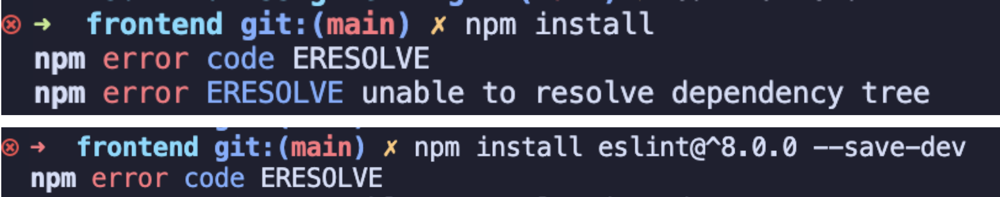
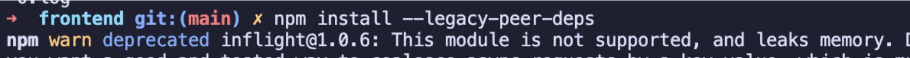

# DevSecOps Pipeline for PERN Stack Application

Welcome to this hands-on project! the goal is to help you build a real-world DevSecOps pipeline for a PERN stack application (PostgreSQL, Express.js, React, Node.js) using free-tier tools. By the end, a fully automated system for testing, deploying, and securing a web app, giving a practical experience with modern software development practices.

## Project Overview 

In today’s fast-paced software world, automating testing, deployment, and security checks is key to delivering reliable applications efficiently. This project guides you through setting up a DevSecOps pipeline using the following free tools:

* **Jenkin**s: For orchestrating the CI/CD pipeline.

* **GitHub Actions**: For additional automation and workflows.

* **Docker Hub**: For storing and managing Docker images.

* **Render**: For deploying the application.

## Getting Started

1. Clone or fork this repositry:

     ```gitclone
     git clone https://github.com/Darshansgit/DSO101_SE_project.git
     ```


     **The Project Folder Overview**
     ```Project structure
          DSO101_Final_project/
          ├── backend/
          │   ├── database/
          │   ├── Dockerfile.dev
          │   ├── Dockerfile.prod
          │   ├── nodemon.json
          │   ├── package.json
          │   ├── public/
          │   ├── src/
          │   │   ├── app.ts
          │   │   ├── bin/
          │   │   ├── config/
          │   │   ├── constants/
          │   │   ├── errors/
          │   │   ├── global.d.ts
          │   │   ├── middlewares/
          │   │   ├── routes/
          │   │   ├── services/
          │   │   └── utils/
          │   ├── sync-package-lock
          │   └── tsconfig.json
          ├── docker/
          │   ├── clean.sh
          │   ├── docker-compose-dev.yml
          │   ├── docker-compose-prod.yml
          │   ├── pull-and-restart.sh
          │   └── push-image.sh
          ├── frontend/
          │   ├── docker-entrypoint.sh
          │   ├── Dockerfile.dev
          │   ├── Dockerfile.prod
          │   ├── nginx/
          │   ├── package.json
          │   ├── public/
          │   ├── src/
          │   │   ├── api/
          │   │   ├── App.tsx
          │   │   ├── components/
          │   │   ├── constants/
          │   │   ├── hooks/
          │   │   ├── i18n/
          │   │   ├── index.tsx
          │   │   ├── routes/
          │   │   ├── style.scss
          │   │   └── utils/
          │   ├── sync-package-lock
          │   └── webpack.config.ts
          ├── LICENSE.md
          └── README.md
     ```
2. BMI Setup(Frontend and Backend):
     
- Frontend:
     ```bash
     cd frontend
     npm install --legacy-peer-deps
     ```

     ```
     npm start
     ```

     **Frontend UI**

     Edit the `src/app.ts` file and add code for the BMI calculator:

     for my case I have created a simple Raw UI.

     

     **Backend**

     Creating a `postgres database` in `Render.com`. (for this project I have used free-tier database only for testing purpose)

     

     Create a `.env` file in the backend directory with the following content:

     ```
          DATABASE_HOST="database host"
          DATABASE_PORT="port number"
          DATABASE_USER="database user name"
          DATABASE_PASSWORD="database password"
          DATABASE_NAME="database name"
     ```

     ```
     cd backend
     npm start
     ```
     

     

     **Test Backned**

     

#### Steps Followed:

**1. Stage 1:** Docker Configuration


**2. Stage2**:Jenkins Local Setup for GitHub Push Automation

Configure a Jenkins pipeline to automatically push code to a GitHub repository when a commit message includes "@push".

*Prerequisites*:
- Jenkins installed and running locally. 

Using homebrew;
```bash
brew install jenkins-lts
```  

Start Jenkins service:
```
brew services start jenkins-lts
```

Stop Jenkins service:
```
brew services stop jenkins-lts
```


- A GitHub repository with write access and a personal access token (PAT) with repo scope.


Manage Jenkins → Credentials → System → Global credentials → Add Credentials

- Type: Username with password

- ID: github-credentials

- Username: GitHub username

- Password: GitHub Personal Access Token (PAT) with repo permissions


Test your pipeline 





2.1 GitHub Actions Pipeline for Docker Builds

steps involved:
- stroing dockerhub credentials in GitHub secrets. 


2.2 Create GitHub Workflow File

`.github/workflows/docker-build.yml`



3: Verify the Workflow
- Commit and push the changes to GitHub.

- Go to the Actions tab in your GitHub repo.

- We will see the workflow triggered by the push.


- After success, go to Docker Hub and verify images are pushed.


3: Deploy to Render 

Go to Render.com and create a new web service.

- Select the Dockerhub option (Backend).

- Select a existing Docker image or specify the image name that is being pushed to Docker Hub. 


### Challenge and solution

Dependency conflict between eslint and eslint-config-react-app. Specifically, eslint-config-react-app requires eslint@^8.0.0, but your project is using eslint@7.32.0.

The npm install command fails because of this version mismatch. To resolve this, you have a few options:



Solutions:

Use *--legacy-peer-deps* (Temporary Workaround): If upgrading eslint is not an option, we can bypass the dependency conflict by running:

```
npm install --legacy-peer-deps
```
